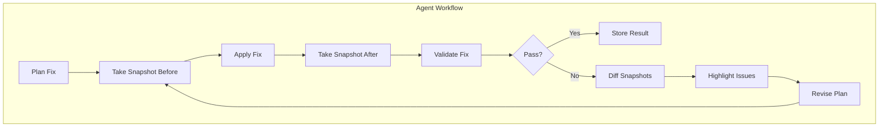

# Sightline Project Code Map

## Overview
This document maps the Sightline MCP + TimezonePulse project structure, key components, and function index. It links snapshots, validations, diffs, and reasoning steps to specific parts of the codebase.

---

## Project Structure
- **sightline-mcp-server/**
  - `src/index.ts`: MCP server entry point, exposes tools (take_snapshot, validate_fix, compare_snapshots, etc.)
  - `package.json`, `tsconfig.json`: project configs
- **snapshots-repo/**
  - Git repo storing serialized snapshots, diffs, validation reports
- **TimezonePulse App**
  - `components/clock/TimezoneCard.tsx`: timezone card UI
  - `components/views/MobileV2ListView.tsx`: timezone list and add button
  - `app/components/Sidebar.tsx`: sidebar navigation
  - `app/components/TimezoneCard.tsx`: legacy timezone card
  - `app/page.tsx`: main entry, renders TimeZonePulse
  - `contexts/TimezoneUIContext.tsx`: pinning state
  - `providers.tsx`: wraps app with providers

---

## Core Functions & Tools
| Function/Tool            | Location                          | Description                                         |
|--------------------------|-----------------------------------|-----------------------------------------------------|
| `take_snapshot`          | sightline-mcp-server/src/index.ts | Capture screenshot, DOM, styles                     |
| `validate_fix`           | sightline-mcp-server/src/index.ts | Validate UI fix success                             |
| `compare_snapshots`      | sightline-mcp-server/src/index.ts | Diff two snapshots                                  |
| `highlight_element`      | sightline-mcp-server/src/index.ts | Visually highlight DOM element                      |
| `TimezoneCard`           | components/clock/TimezoneCard.tsx | Display timezone info                               |
| `AddTimezoneButton`      | components/views/MobileV2ListView.tsx | Add timezone ghost card/button                  |
| `Sidebar`                | app/components/Sidebar.tsx        | Navigation sidebar                                  |

---

## Flow Diagrams

---

## Links to Snapshots, Validations, Diffs
- Snapshots stored in `snapshots-repo/` and tracked in knowledge graph
- Validation results linked to snapshots via `producesValidationResult` relation
- Diffs linked to snapshots via `comparesSourceSnapshot` and `comparesTargetSnapshot`
- Reasoning steps logged in `activeContext.md` and `decisions.md`

---

_Last updated: 2025-04-07_
