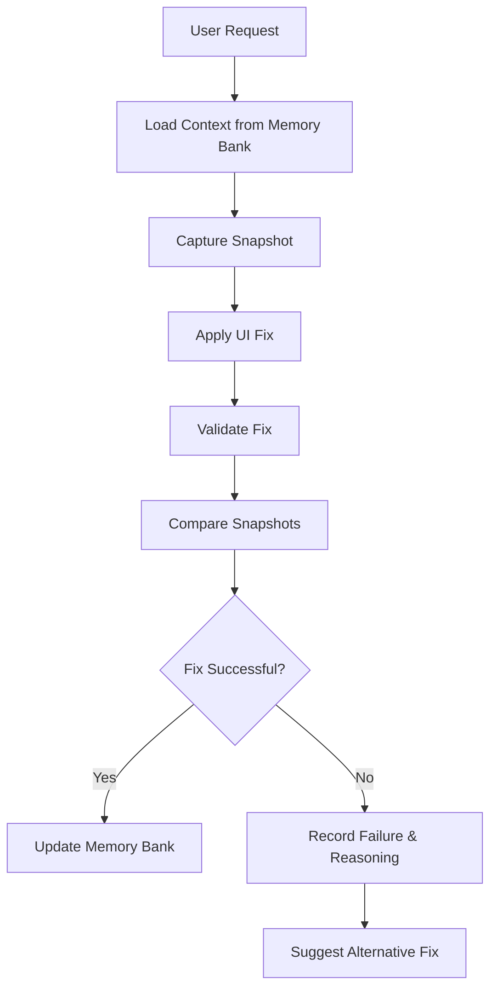

# CodeMap Root
timestamp: 2025-04-08T11:33:00Z {level: metadata}

## ACTIVE_MEMORY
- Components: [#UI_BUTTON, #VALIDATION_001, #DIFF_001]
- Decisions: [#DEC_FIX_BUTTON_COLOR]
- Patterns: [@SnapshotCapture, @Validation, @VisualDiff]
- Tasks: [TASK_001]

## CACHED_MEMORY
- Components: [#UI_HEADER, #UI_FOOTER]
- Decisions: [#DEC_HEADER_STYLE]
- Tasks: []

## ARCHIVED_MEMORY
- Components: [#UI_OLD_LOGIN]
- Decisions: [#DEC_DEPRECATED_LOGIN]
- Tasks: [tasks/archive/task_000.md]

## PROJECT_STRUCTURE
memory_docs/
  projectbrief.md
  productContext.md
  activeContext.md
  systemPatterns.md
  techContext.md
  progress.md
  decisions.md
  codeMap_root.md
  indexes/
    components_index.yaml
    validations_index.yaml
    diffs_index.yaml
  tasks/
    task_registry.md
    archive/

snapshots-repo/
  *.png
  *.html
  *.css
  *.json
  *.txt

sightline.db

## FLOW_DIAGRAMS

### UI Fix Flow

## Notes
- ACTIVE_MEMORY contains current focus components, recent snapshots, validations, diffs, and active tasks.
- CACHED_MEMORY holds related but not immediately relevant components and decisions.
- ARCHIVED_MEMORY contains deprecated components, old decisions, and completed tasks.
- This structure supports efficient, context-aware loading and persistent knowledge management for Sightline.
